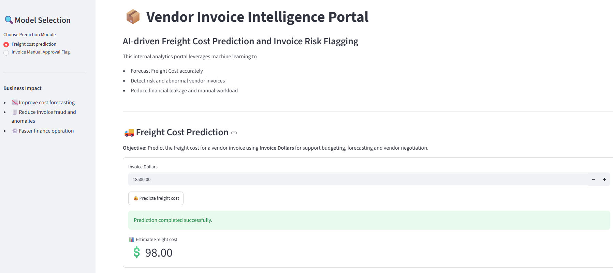
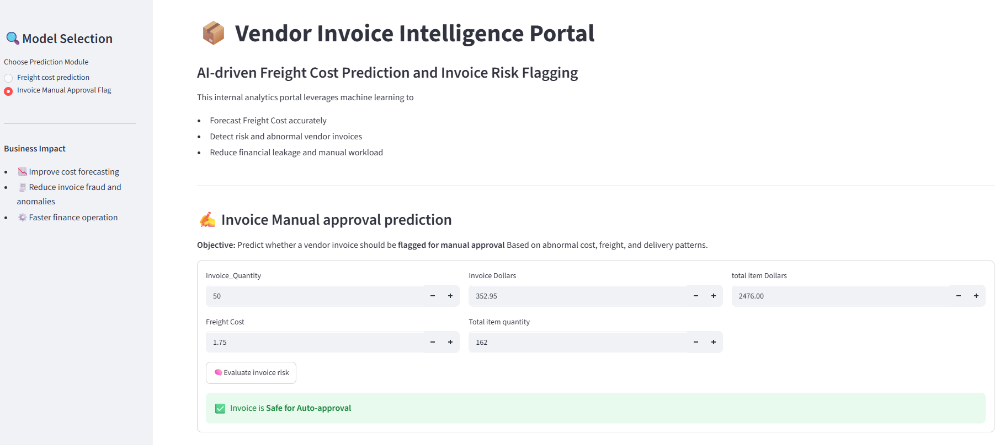

# 🏭 Vendor Intelligence & Predictive Analytics Platform

_ Analysing vendor performance and developing machine learning solutions for freight cost prediction and invoice risk flagging to support procurement optimisation and supply chain decision-making using Python, SQL, Scikit-learn, and Streamlit._

---

## 📋 Table of Contents
- <a href="#project-overview">Project Overview</a>
- <a href="#business-problem--key-features">Business Problem & Key Features</a>
- <a href="#dataset-overview">Dataset Overview</a>
- <a href="#data-cleaning--preparation">Data cleaning & preparation</a>
- <a href="#exploratory-data-analysis">Exploratory Data Analysis</a>
- <a href="#machine-learning-models">Machine Learning Models</a>
- <a href="#model-evaluation">Model Evaluation</a>
- <a href="#project-structure">Project Structure</a>
- <a href="#how-the-models-work">How the Models Work</a>
- <a href="#research-questions--key-findings">Research Questions & Key Findings</a>
- <a href="#recommendations">Recommendations</a>
- <a href="#author--contact">Author & Contact</a>

---

<h2><a class="anchor" id="project-overview"></a>🧩 Project Overview</h2>

This project aims to enhance procurement efficiency by **analyzing vendor performance** and developing **predictive models for freight cost** estimation and **invoice risk assessment**. It implements an **end-to-end machine learning system** to identify cost drivers, predict freight expenses for vendor invoices, and flag invoices that may require manual review due to unusual cost, freight, or operational patterns.

---

<h2><a class="anchor" id="business-problem--key-features"></a>❗ Business Problem & Key Features</h2>

**1. Vendor Performance Analysis**

   **Objective:**
   Analyze vendor performance to identify procurement inefficiencies, profitability trends, inventory-      related issues, and opportunities for cost optimization.

**Use of this analysis:**

* Identify underperforming brands requiring pricing, promotion, or procurement strategy adjustments.
* Evaluate profit margin confidence intervals for top-performing and low-performing vendors.
* Assess capital tied up in slow-moving or excess inventory across vendors.
* Identify vendors and brands demonstrating strong sales and profitability performance.
* Analyze procurement dependency on key vendors and associated concentration risks.


**2. Freight cost prediction (Regression model)**

   **Objective:**
      Predicting the expected freight cost for the vendor invoice using invoice value and the historical behaviour of the dataset.

**Use of this model:**
* Freight is a non-trivial component of landed cost.
* Poor freight estimates distort margin and inventory planning.
* Automating freight estimation helps procurement teams forecast true cost before invoice arrival.


**3. Invoice risk flagging (Classification model)**

   **Objective:**
   Predict whether vendor invoice should be flagged for manual approval or not due to abnormal cost, freight, and delivery patterns.

**Use of this model:**
* Manual Invoice review is time-consuming and does not scale with transaction volume.
* Abnormal freight charges, pricing deviation, or delivery delays often indicate errors, disputes, or compliance risks.
* An automated flagging system enables finance teams to focus attention on high-risk invoice while allowing low-risk invoice to be processed automatically.


---

<h2><a class="anchor" id="dataset-overview"></a>📦 Dataset Overview</h2>
Data is stored in a relational MySQL database (`inventory_database`) consisting of the following tables:

* **vendor_invoice** – Invoice-level financial, freight, and transaction timing information.
* **sales** – Brand-level sales transactions and revenue data.
* **purchases** – Brand-level procurement and purchasing data.
* **purchase_price** – Reference purchase prices for products and brands.
* **begin_inventory** and **end_inventory** – Snapshots of inventory levels at the beginning and end of the year.
* **vendor_sales_summary** – Vendor-level aggregated purchases and sales data derived from the above tables for vendor performance analysis.

---

<h2><a class="anchor" id="data-cleaning--preparation"</a>🛠️ data cleaning & preparation</h2>

- Removed transaction with:
  - Gross Profit <=0
  - Profit Margin <=0
  - Sales Quantity = 0
- Created summary table with vendor-level metrics.
- Convert data type, fill null values, handle outliers, merge lockup tables.

---

<h2><a class="anchor" id="exploratory-data-analysis"></a>📊 Exploratory Data Analysis</h2>

**1. Data Quality Assessment**

* Negative gross profit values detected, indicating loss-making sales.
* Profit margins at or below zero identified, suggesting sales made at or below cost.
* Unsold inventory observed across multiple products, highlighting potential slow-moving stock.

**2. Outlier Detection**

* Extreme freight costs identified, with values reaching up to 257K.
* Unusually high purchase and actual prices detected in certain transactions.

**3. Correlation Analysis**

* Weak relationship observed between Purchase Price and Profit.
* Strong positive correlation between Purchase Quantity and Sales Quantity (0.999).
* Weak negative correlation between Profit Margin and Sales Price (-0.179).

**4. Business-Driven Analysis**

* Investigated whether flagged invoices exhibit higher financial exposure.
* Analyzed the relationship between Freight Cost, Quantity, and Invoice Value.
* Evaluated key factors influencing freight expenses and invoice risk.

**5. Statistical Validation**

* Applied t-tests to determine whether flagged invoices differ significantly from normal invoices.
  
---

<h2><a class="anchor" id="machine-learning-models"></a>🤖 Machine Learning Models</h2>

**Regression models(Freight cost prediction)**
  - Linear Regression (baseline model)
  - Decision Tree Regressor
  - Random Forest Regressor (final model)

**Classification models(Invoice Flagging)**
  - Logistic Regression (Baseline model)
  - Decision Tree Classifier
  - Random Forest Classifier (Final model with GridSearchCV)<br>

- Hyperparameter tuning is performed using GridSearchCV with F1-score to handle the class imbalance.

---

<h2><a class="anchor" id="model-evaluation"></a>📈 Model Evaluation</h2>

**Freight prediction**
- MAE
- MSE
- R^2 score

**Invoice Flagging**
- Accuracy
- Precision, Recall, F1-score
- Classification report
- Feature importance analysis

---

<h2><a class="anchor" id="project-structure"></a>🗂️ Project Structure</h2>


```text
Vendor-Intelligence-Platform/
│
├── data/
├── script/
├── notebooks/
├── images/
│
├── analytics/
│   ├── get_vendor_summary.py
│   ├── vendor_analysis.ipynb
│   └── business_report.pdf
│
├── ml/
│   ├── freight_cost_prediction/
│   │   ├── data_preprocessing.py
│   │   ├── model_evalution.py
│   │   └── train.py
│   │
│   ├── invoice_flagging/
│   │   ├── data_preprocessing.py
│   │   ├── model_evalution.py
│   │   └── train.py
│   │
│   ├── inference/
│   │   ├── predict_freight.py
│   │   └── predict_invoice.py
│   │
│   └── models/
│       ├── predict_freight_model.pkl
│       ├── predict_flag_invoice.pkl
│       └── scaler.pkl
│
├── streamlit_file
|     ├── requirement.txt 
|     └── app.py
└── README.md
```

---

<h2><a class="anchor" id="how-the-models-work"></a>⚙️ How the Models Work</h2>

1. Clone the repository:
   ```bash
   https://github.com/pandeyanjali9798-coder/Vendor-Intelligence-And-Predictive-Analytics-Platform.git
   ```

2. Train and save the best fit model:
   ```bash
   python (ml/freight_cost_prediction/train.py)
   python (ml/invoice_flagging/train.py)
   ```

3. Test model:
   ```bash
   python (ml/inference/predict_freight.py)
   python (inference/predict_invoice_flag.py)
   ```

4. Open application:
   ```bash
   streamlit run (app.py)
   ```
5. link of deployed app:
   ```bash
   https://vendor-intelligence-and-predictive-analytics-platform-vgylqoed.streamlit.app/
   ```

---

<h2><a class="anchor" id="research-questions--key-findings"></a>❓ Research Questions & Key Findings</h2>

1. **Bands for promotions:** 198 bands with low performance and high profit margin.
2. **Top vendors:** total procurement by top 10 vendors is 65.69% - risk of over-reliance.
3. **Bulk purchasing impact:** 72% cost saving per unit in large orders.
4. **Inventory Turnover:** $2.71M worth of unsold inventory.
5. **Vendor Profitiability:**
    - high vendors: Mean Margin = 31.17%
    - low vendors: Mean Margin = 41.55%
6. **Hypothetical Testing:** Statistically significant difference in profit margin - distinct vendor strategies.

---

<h2><a class="anchor" id="recommendations"></a>💡 Recommendations</h2>

- Promote low-performing, high-margin brands to increase sales and profitability.
- Diversify suppliers to reduce over-reliance on the top 10 vendors.
- Use bulk purchasing for fast-moving products to maximize cost savings.
- Improve inventory planning to reduce unsold stock and free up working capital.
- Prioritize vendors with higher profit margins while maintaining strong sales performance.

---

<h2><a class="anchor" id="author--contact"></a>👤 Author & Contact</h2>

**👤 Anjali Pandey** <br>
✉️ Email: pandeyanjali9798@gmail.com <br>
🔗[LinkIn]: [View Profile] https://www.linkedin.com/in/anjali-kumari-530467390


---

